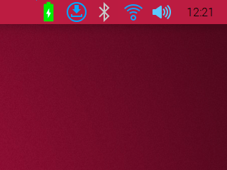

# CrowPi L Battery status

Battery status for the [CrowPi L laptop](https://www.crowpi.cc/products/crowpi-l), with the native Linux Raspberry Pi OS, standing in the system tray, written with python3 and python3-pyqt5.



## Features

- 7 state icons of the battery from 0% to 100%,
- icon when charging,
- alert icon when battery is very low,
- tooltip to view the percentage of the battery load and its voltage,
- contextual menu to properly quit the app.

## Installing and starting the application

From a terminal, install python3-pyqt5

```
$ sudo apt install python3-pyqt5
```

From a terminal, clone this projet (the first time only), go to its directory, make it executable (the first time only), run it and enjoy!

```
$ git clone git@github.com:ppyne/crowPi-L_BatteryStatus.git
$ cd crowPi-L_BatteryStatus/
$ chmod +x ./batteryStatus.py
$ ./batteryStatus.py
```

**Warning:** to quit the app properly, you must right click on its icon in the system tray and click the menu "Quit".
